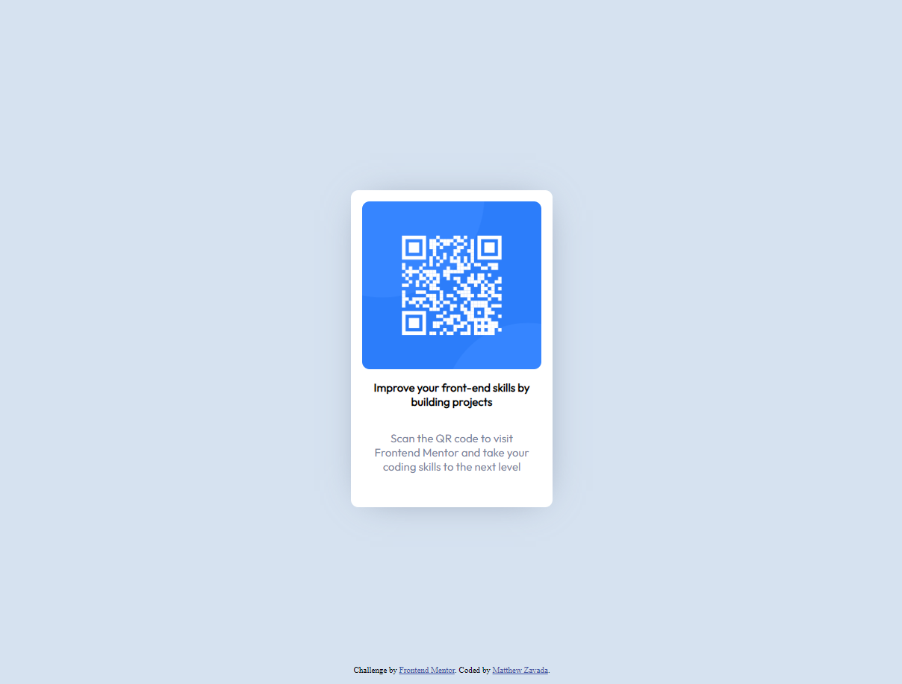

# Frontend Mentor - QR code component solution

This is a solution to the [QR code component challenge on Frontend Mentor](https://www.frontendmentor.io/challenges/qr-code-component-iux_sIO_H). Frontend Mentor challenges help you improve your coding skills by building realistic projects. 

## Table of contents

- [Overview](#overview)
  - [Screenshot](#screenshot)
  - [Links](#links)
- [My process](#my-process)
  - [Built with](#built-with)
  - [What I learned](#what-i-learned)
  - [Continued development](#continued-development)
  - [Useful resources](#useful-resources)
- [Author](#author)

## Overview
- This is my first Frontend Mentor project. Using these projects to learn more about HTML, CSS, and Github.

### Screenshot



### Links

- Solution URL: [Add solution URL here](https://your-solution-url.com)
- Live Site URL: [Add live site URL here](https://your-live-site-url.com)

## My process

### Built with

- Semantic HTML5 markup
- CSS custom properties
- Flexbox
- Google Fonts


### What I learned

Use this section to recap over some of your major learnings while working through this project. Writing these out and providing code samples of areas you want to highlight is a great way to reinforce your own knowledge.

To see how you can add code snippets, see below:

```css
body{
  background-color: hsl(212, 45%, 89%);display: flex;
  align-items: center;
  justify-content: center;
  height: 100vh;
}

h1::before{
  content:"";
  display: block;
  width: auto;
  height: 225px;
  background: url("../images/image-qr-code.png") no-repeat;
  background-size: cover;
  background-position: center center;
  border-radius: 10px;
  border: none;
  margin-bottom: 15px;
}
```
### Continued development

- I would like to learn more to use flexbox and CSS grid.

### Useful resources

- [Step up your front-end skills with these 5 resources](https://youtu.be/QqDH5sYzDS8) - Followed recommedantion from Kevin Powell to try out Frontend Mentor.

## Author

- Website - [Matthew Zavada](https://www.your-site.com)
- Frontend Mentor - [@mattzavada](https://www.frontendmentor.io/profile/mattzavada)

