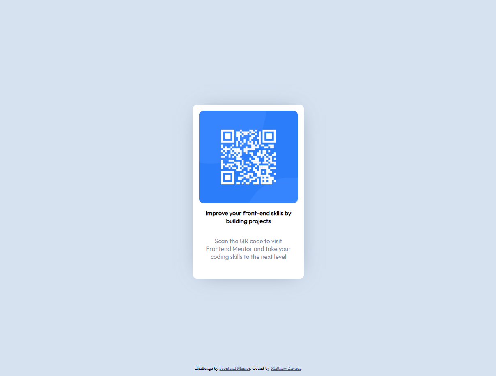

# Frontend Mentor - QR code component solution

This is a solution to the [QR code component challenge on Frontend Mentor](https://www.frontendmentor.io/challenges/qr-code-component-iux_sIO_H). Frontend Mentor challenges help you improve your coding skills by building realistic projects. 

## Table of contents

- [Overview](#overview)
  - [Screenshot](#screenshot)
  - [Links](#links)
- [My process](#my-process)
  - [Built with](#built-with)
  - [What I learned](#what-i-learned)
  - [Continued development](#continued-development)
  - [Useful resources](#useful-resources)
- [Author](#author)

## Overview
- This is my first Frontend Mentor project. Using these projects to learn more about HTML, CSS, and Github.

### Screenshot



### Links

- Solution URL: [Add solution URL here](https://your-solution-url.com)
- Live Site URL: [Add live site URL here](https://your-live-site-url.com)

## My process

### Built with

- Semantic HTML5 markup
- CSS custom properties
- Flexbox
- Google Fonts


### What I learned

I learned that to center vertically the entire contents with Flexbox, I needed to add a height to the parent container (body) to 100vh. Additionally to add an image before the h1 tag, I needed to set the display to block, set a height for the image, background-size to cover and provide an empty content value.

```css
body{
  background-color: hsl(212, 45%, 89%);display: flex;
  align-items: center;
  justify-content: center;
  height: 100vh;
}

h1::before{
  content:"";
  display: block;
  width: auto;
  height: 225px;
  background: url("../images/image-qr-code.png") no-repeat;
  background-size: cover;
  border-radius: 10px;
  border: none;
  margin-bottom: 15px;
}
```
### Continued development

- I would like to learn more about the use of flexbox and CSS grid.

### Useful resources

- [Step up your front-end skills with these 5 resources](https://youtu.be/QqDH5sYzDS8) - Followed recommedantion from Kevin Powell to try out Frontend Mentor.

## Author

- Website - [Matthew Zavada](https://www.your-site.com)
- Frontend Mentor - [@mattzavada](https://www.frontendmentor.io/profile/mattzavada)

